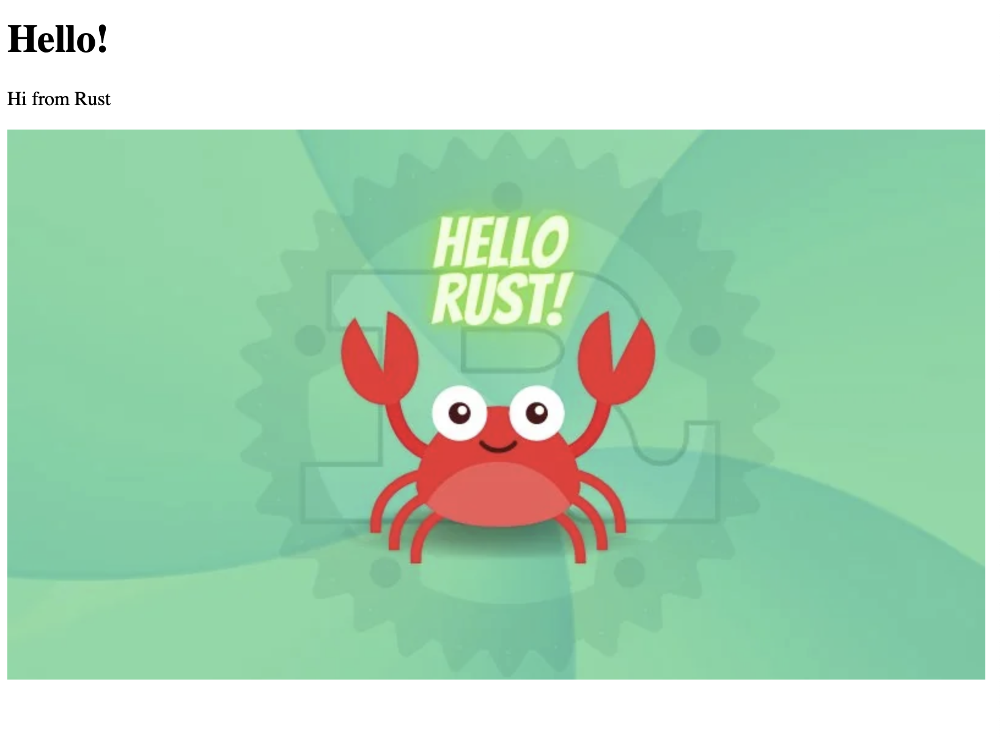
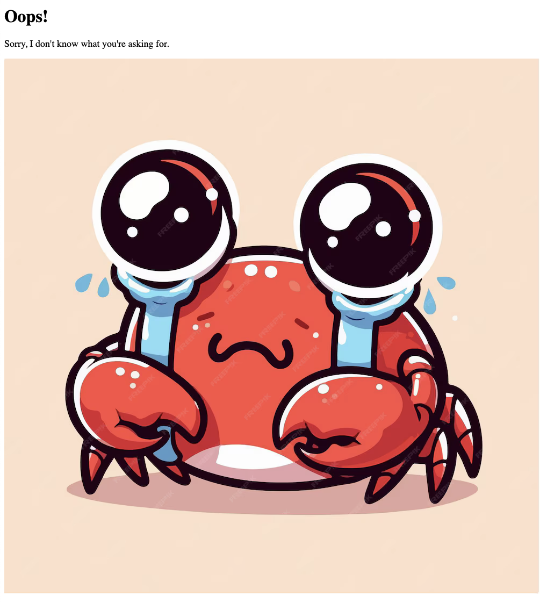

This project is the final project of the [rust book](https://rust-book.cs.brown.edu/ch21-00-final-project-a-web-server.html)

It's a basic multithreaded web server that does:

- Listen for TCP connections on a socket.
- Parse a small number of HTTP requests.
- Create a proper HTTP response.
- Improve the throughput of our server with a thread pool.

and looks like this:

Some follow-ups:

- Add more documentation to ThreadPool and its public methods.
- Add tests of the library’s functionality.
- Change calls to unwrap to more robust error handling.
- Use ThreadPool to perform some task other than serving web requests.
- Find a thread pool crate on crates.io and implement a similar web server using the crate instead. Then compare its API and robustness to the thread pool we implemented.
